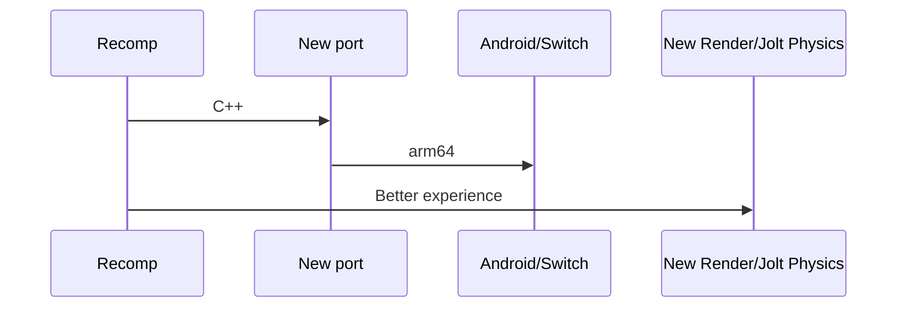

# reNEVADA360
A recompilation of Fallout New Vegas (USA) + Ultimate Edition using ReXGlue SDK

## Logo of recomp:

## How does the project work?

We are using the latest version of the ReXGlue SDK (08/09/26 - 0.10.0) to recompile the game, utilizing its tools, Ghidra 12, and Visual Studio 2026 + Developer Command Prompt.

*Current progress (08/09/26)*

You can't see the image clearly, but it shows the game launching for the first time after fixing the SDK Kernel/FileSystem and enabling Xenos in the project.
It's still in the very early stages, so I'll only release an .exe much later, once there's something at least minimally playable.You can't see the image clearly, but it shows the game launching for the first time after fixing the SDK Kernel/FileSystem and enabling Xenos in the project.
It's still in the very early stages, so I'll only release an .exe much later, once there's something at least minimally playable.

## Future of project:

You can render UML diagrams using [Mermaid](https://mermaidjs.github.io/). For example, this will produce a sequence diagram:

## Build project:
1- Download and clone SDK: https://github.com/rexglue/rexglue-sdk.git

2- Use -help in CMD/VS 2022/VS 2026 to see to make projects, fix bugs, the doc ans others

3- rexglue init --project-name "nv_recomp" --xex-path "{xex path}" --project-root ./nv_recomp

4- rexglue --verbose --log-file codegen.log codegen

5- cmake --preset win-amd64-debug (project and SDK)

6- cmake --build --preset win-amd64-debug (project and SDK)

7- cdb -g -G -logo game_run.log -c "g;kb;q" "{path of your .exe recompiled}" --game_data_root="{assets of game}" - Debug .exe in CMD of VS

It’s still very early days, and it will take a while for things to get done, but we’ll get there eventually. If you’re interested, take a look at this other project where *Fallout: New Vegas* is being ported to the Godot Engine: https://github.com/nikamigaming-create/OpenNV

## Licence:
I released the project under the MIT license—I don't know much about licenses—and there are no game assets included, only ReXGlue content. If you want to play it later, make sure you have your own complete US copy of the game, okay?
